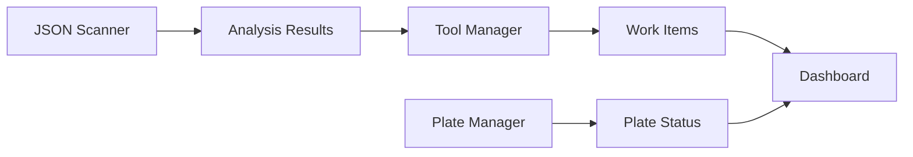

# CNC Management Dashboard - Unified Repository Architecture

## Overview

CNCManagementDashboard serves as the main application that integrates three specialized modules:

- **JSONScanner**: Analyzes CAD JSON files and applies manufacturing rules
- **ToolManager**: Processes Excel tool matrices and manages work tracking
- **ClampingPlateManager**: Manages clamping plate inventory and workflows

## Repository Structure

```
CNCManagementDashboard/
├── README.md                    # Main repository documentation
├── package.json                 # Main package configuration
├── SETUP_GUIDE.md              # Installation and setup instructions
├── modules/                     # Sub-project modules
│   ├── JSONScanner/            # JSON analysis module
│   ├── ToolManager/            # Tool management module
│   └── ClampingPlateManager/   # Plate management module
├── src/                        # Main dashboard application
├── config/                     # Global configuration
├── docs/                       # Comprehensive documentation
└── test_data_samples/          # Downloadable test data archive
```

## Module Integration Strategy

### 1. Git Submodules Approach

Each module maintains its own repository while being included as a submodule:

```bash
# Clone main repository with all modules
git clone --recursive https://github.com/company/CNCManagementDashboard.git

# Or clone main repo and add modules
git clone https://github.com/company/CNCManagementDashboard.git
cd CNCManagementDashboard
git submodule init
git submodule update
```

### 2. Module Package Scripts

Main `package.json` includes scripts for all modules:

```json
{
  "scripts": {
    "setup": "npm run setup:all",
    "setup:all": "npm run setup:main && npm run setup:modules",
    "setup:main": "npm install",
    "setup:modules": "cd modules/JSONScanner && npm install && cd ../ToolManager && npm install && cd ../ClampingPlateManager && npm install",
    "dev": "concurrently \"npm run dev:main\" \"npm run dev:modules\"",
    "dev:main": "npm run dev --prefix .",
    "dev:modules": "concurrently \"npm run dev --prefix modules/JSONScanner\" \"npm run dev --prefix modules/ToolManager\" \"npm run dev --prefix modules/ClampingPlateManager\"",
    "test": "npm run test:all",
    "test:all": "npm run test:main && npm run test:modules",
    "test:modules": "cd modules/JSONScanner && npm test && cd ../ToolManager && npm test && cd ../ClampingPlateManager && npm test"
  }
}
```

### 3. Unified Configuration

Central configuration that coordinates all modules:

```javascript
// config/unified.config.js
module.exports = {
  dashboard: {
    port: 3000,
    title: "CNC Management Dashboard",
  },
  modules: {
    jsonScanner: {
      enabled: true,
      port: 3001,
      dataPath: "./modules/JSONScanner/test_data",
    },
    toolManager: {
      enabled: true,
      port: 3002,
      dataPath: "./modules/ToolManager/test_data",
    },
    clampingPlateManager: {
      enabled: true,
      port: 3003,
      dataPath: "./modules/ClampingPlateManager/test_data",
    },
  },
};
```

## Data Management

### Test Data Organization

Each module keeps its essential test data:

```
modules/
├── JSONScanner/
│   └── test_data/               # CAD project samples (KEEP)
│       ├── testPathHumming_auto/
│       └── testPathOne_manual/
├── ToolManager/
│   └── test_data/               # Excel matrix samples (KEEP)
│       ├── filesToProcess/
│       ├── sampleExcels/
│       └── testJSONs/
└── ClampingPlateManager/
    └── test_data/               # Plate inventory samples (KEEP)
        ├── 1_alap/
        ├── 10/ ... 38/
        └── Készülékek.xlsx
```

### Test Data Download Feature

New users can download all test data through the setup wizard:

```
test_data_samples/
├── JSONScanner_samples.zip      # Compressed test data
├── toolmanager_samples.zip      # Compressed test data
├── clampingplate_samples.zip    # Compressed test data
└── download_guide.md            # Instructions for using samples
```

## Integration Points

### 1. Data Flow Integration



### 2. API Integration

Each module exposes REST APIs that the dashboard consumes:

- **JSONScanner**: `/api/v1/analysis/*`
- **ToolManager**: `/api/v1/tools/*`
- **ClampingPlateManager**: `/api/v1/plates/*`

### 3. Database Integration

Unified database schema with module-specific tables:

```sql
-- JSON Scanner tables
CREATE TABLE json_analysis_results (...);
CREATE TABLE scanning_rules (...);

-- Tool Manager tables
CREATE TABLE tool_inventory (...);
CREATE TABLE work_tracking (...);

-- Plate Manager tables
CREATE TABLE clamping_plates (...);
CREATE TABLE plate_usage (...);
```

## Setup Process

### 1. Repository Setup

```bash
# Clone with all modules
git clone --recursive https://github.com/company/CNCManagementDashboard.git
cd CNCManagementDashboard

# Install dependencies for all modules
npm run setup:all
```

### 2. Configuration Setup

Run the unified setup wizard:

```bash
npm run setup
```

The setup wizard will:

1. Configure company information
2. Set up database connections
3. Configure module paths and settings
4. Offer to download test data samples
5. Initialize all module configurations

### 3. Development Mode

```bash
# Start all modules in development mode
npm run dev
```

Starts:

- Main dashboard on port 3000
- JSON Scanner API on port 3001
- Tool Manager API on port 3002
- Plate Manager API on port 3003

## Benefits

1. **Unified Experience**: Single setup and configuration process
2. **Modular Development**: Each module can be developed independently
3. **Easy Deployment**: Single repository for deployment
4. **Shared Resources**: Common utilities, configuration, and documentation
5. **Test Data Access**: New users can easily get sample data
6. **Version Coordination**: All modules versioned together for compatibility

## Migration Plan

1. Create `modules/` directory in CNCManagementDashboard
2. Add existing projects as Git submodules
3. Update main package.json with module scripts
4. Create unified configuration system
5. Update setup wizard to include module configuration
6. Create test data download feature
7. Update all documentation
